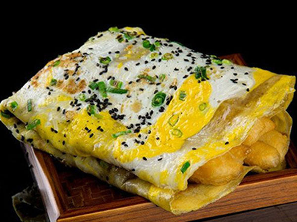

# TopN Test for Massive Halos Selected by Richness and Stellar Mass of the Central Galaxy

---- 

- Code, Jupyter Notebooks, and Data for reproducing the results for: "The Outer Stellar Mass of
  Massive Galaxies: A Simple Tracer of Halo Mass with Scatter Comparable to Richness and Reduced
  ProjectionEffects" (Huang et al. in prep).

- The large data files that are necessary to reproduce our results can be found in [this Zenodo repo](https://zenodo.org/record/5259075#.YSaiKNNKjOQ)

- Please contact the authors if you have any questions about the code or the data.

----

## Baisc Structures

- [`jianbing`](https://github.com/dr-guangtou/jianbing/tree/master/jianbing): include all the codes used for this work and other TopN tests.
  - Most important codes for lensing analysis can be found under [`wlensing.py`](https://github.com/dr-guangtou/jianbing/blob/master/jianbing/wlensing.py) and [`scatter.py`](https://github.com/dr-guangtou/jianbing/blob/master/jianbing/scatter.py).
  - Our code depends on the [`dsigma`](https://github.com/johannesulf/dsigma) galaxy-galaxy lensing package.

- `paper`:
  - `LaTeX` source files of the TopN paper. (Will become available after submission).

- [`notebooks`](https://github.com/dr-guangtou/jianbing/tree/master/notebooks): all the Jupyter notebooks for the TopN tests.
  - [`figure`](https://github.com/dr-guangtou/jianbing/tree/master/notebooks/figure) include all the notebooks for making figures in our paper.
  - [`topn_result_summary.ipynb`](https://github.com/dr-guangtou/jianbing/blob/master/notebooks/topn_result_summary.ipynb) summarizes all the key results of the TopN tests.

- [`script`](https://github.com/dr-guangtou/jianbing/tree/master/script): Python scripts for pre-computing the galaxy-galaxy lensing profiles and performing the TopN tests.
  - [`prepare_source_random.py`](https://github.com/dr-guangtou/jianbing/blob/master/script/prepare_source_random.py): prepare the source and random catalogs. This creates the `s16a_weak_lensing_medium.hdf5` file that can be found in the Zenodo repo.
  - [`precompute_lens_public.py`](https://github.com/dr-guangtou/jianbing/blob/master/script/precompute_lens_public.py): pre-compute the lensing profiles for different catalogs of galaxies and galaxy clusters.
  - [`compute_dsigma_galaxies.py`](https://github.com/dr-guangtou/jianbing/blob/master/script/compute_dsigma_galaxies.py) and [`compute_dsigma_clusters.py`](https://github.com/dr-guangtou/jianbing/blob/master/script/compute_dsigma_clusters.py): perform TopN tests for galaxies and clusters. 

- [`data`](https://github.com/dr-guangtou/jianbing/tree/master/data): TopN tests results and other useful data files.
  - [`results`](https://github.com/dr-guangtou/jianbing/tree/master/data/results): `pickle` files for different groups of TopN tests results.
  - [`simulation`](https://github.com/dr-guangtou/jianbing/tree/master/data/simulation): lensing profiles and halo mass distributions of halos from MDPL2 and SMDPL N-body simulations.
  - [`bins`](https://github.com/dr-guangtou/jianbing/tree/master/data/bins): definitions of the default four TopN bins.
  - [`satellite`](https://github.com/dr-guangtou/jianbing/tree/master/data/satellite): `pickle` files for comparing the lensing profiles of central-only and central+satellite samples.
  - [`index`](https://github.com/dr-guangtou/jianbing/tree/master/data/index): index files used for cross-matching different samples.

---

